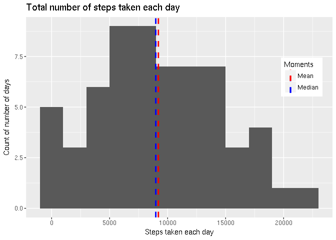
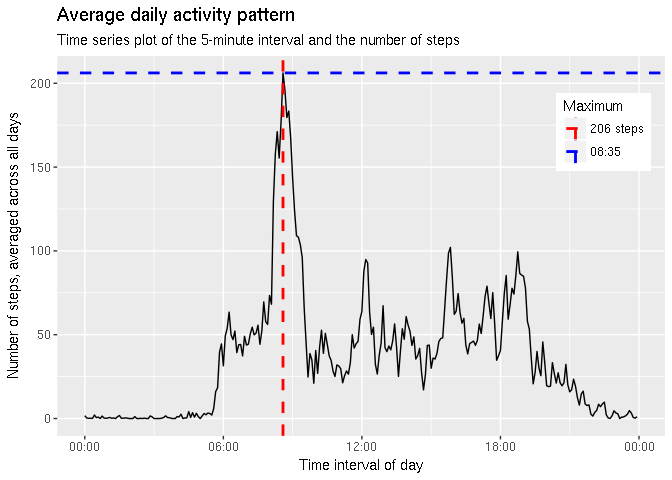
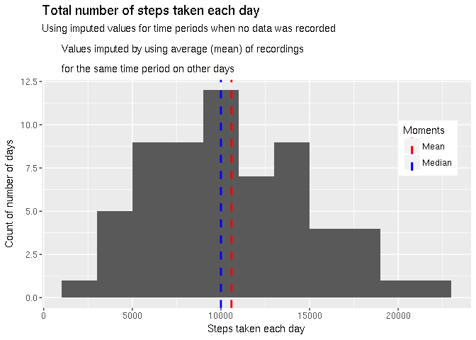
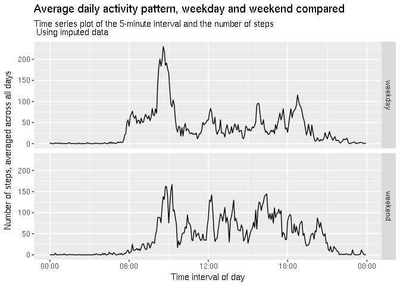

# Reproducible Research: Peer Assessment 1

## Project

This project was written by David Fong for a
Reproducible Data (John Hopkins, Coursera) course assignment.

## Introduction

It is now possible to collect a large amount of data about personal
movement using activity monitoring devices such as a
[Fitbit](http://www.fitbit.com), [Nike
Fuelband](http://www.nike.com/us/en_us/c/nikeplus-fuelband), or
[Jawbone Up](https://jawbone.com/up). These type of devices are part of
the "quantified self" movement -- a group of enthusiasts who take
measurements about themselves regularly to improve their health, to
find patterns in their behavior, or because they are tech geeks. But
these data remain under-utilized both because the raw data are hard to
obtain and there is a lack of statistical methods and software for
processing and interpreting the data.

This assignment makes use of data from a personal activity monitoring
device. This device collects data at 5 minute intervals through out the
day. The data consists of two months of data from an anonymous
individual collected during the months of October and November, 2012
and include the number of steps taken in 5 minute intervals each day.

## Loading and preprocessing the data

The data for this assignment can be downloaded from the course web
site:

* Dataset: [Activity monitoring data](https://d396qusza40orc.cloudfront.net/repdata%2Fdata%2Factivity.zip) [52K]

The variables included in this dataset are:

* **steps**: Number of steps taking in a 5-minute interval (missing
    values are coded as `NA`)

* **date**: The date on which the measurement was taken in YYYY-MM-DD
    format

* **interval**: Identifier for the 5-minute interval in which
    measurement was taken - read as a numeric, where '1355' means 13h:55m and '14:00' means 14h:00m 

The variables **date** and **interval** are converted into a single variable **time**


```r
### start necessary libraries
library(tidyverse)
library(dplyr)
library(ggplot2)

### set figure save path to figure/
knitr::opts_chunk$set(fig.path = 'figure/')
```


```r
### download data ZIP file if necessary, and extract if necessary
if (!file.exists('activity.csv')) {
  if (!file.exists('activitydata.zip')) {
    if (download.file('https://d396qusza40orc.cloudfront.net/repdata%2Fdata%2Factivity.zip','activitydata.zip')) {
      stop('Unable to download data file')
    }
  }
  unzip('activitydata.zip')
}

### read activity data into 'step.data'
step.data <- as.tibble(read.csv('activity.csv'))
### then convert the date/interval into a time variable
step.data$time <- as.POSIXct(strptime(paste(step.data$date,sprintf('%04d',step.data$interval)),'%Y-%m-%d %H%M'))
```

## What is the mean total number of steps taken per day?


```r
### calculate the total number of steps taken on each day of recording
daily.steps <- step.data %>%
  group_by(as.Date(time)) %>%
  summarise(steps = sum(steps, na.rm = TRUE ))

ggplot(daily.steps, aes(daily.steps$steps)) +
  geom_histogram(binwidth = 2000) +
  labs(title = "Total number of steps taken each day") +
  labs(x = "Steps taken each day", y = "Count of number of days") + 
  geom_vline(aes(xintercept = mean(daily.steps$steps), color = 'Mean'), linetype = 'dashed', size = 1) +
  geom_vline(aes(xintercept = median(daily.steps$steps), color = 'Median'), linetype = 'dashed', size = 1) +
  scale_color_manual(name = 'Moments', values = c(Median = 'blue', Mean = 'red')) + 
  theme(legend.position = c(0.9,0.7))
```

<!-- -->

Mean number of steps daily = 9203.4

Median number of steps daily = 8978.5

## What is the average daily activity pattern?


```r
### calculate the average (mean) number of steps in each 5-minute period across all days
interval.steps <- step.data %>%
  mutate(interval = as.POSIXct(format(time, format='%H:%M:%S'), format = '%H:%M:%S')) %>%
  group_by(interval) %>%
  summarise(steps = mean(steps, na.rm = TRUE))

### find the maximum number of average steps in any 5-minute period, and find the period
interval.step.max <- max(interval.steps$steps)
interval.step.max.period <- interval.steps$interval[which.max(interval.steps$steps)]

ggplot(interval.steps, aes(x = interval, y = steps)) +
  geom_line() +
  labs(title = 'Average daily activity pattern',
       subtitle = 'Time series plot of the 5-minute interval and the number of steps') +
  labs(x = 'Time interval of day', y = 'Number of steps, averaged across all days') +
  scale_x_datetime(date_labels = '%H:%M') +
  ### add lines to indicate time period of maximum number of average steps
  geom_hline(aes(yintercept = max(interval.step.max), color = '206 steps'), linetype = 'dashed', size = 1) +
  geom_vline(aes(xintercept = as.numeric(interval.step.max.period), color = '08:35'),
                 linetype = 'dashed', size = 1) +
  scale_color_manual(name = 'Maximum', labels = c('206 steps', '08:35'), values = c('red', 'blue')) +
  theme(legend.position = c(0.9,0.8))
```

<!-- -->

The 5-minute interval, calculated average across all days, with the maximum number of average steps:
08:35

## Imputing missing values

There are a number of days/intervals where there are missing
values (coded as `NA`). The presence of missing days may introduce
bias into some calculations or summaries of the data.


```r
### Calculate and report the total number of missing values in the dataset

number.of.na <- sum(is.na(step.data$steps))
```

There are 2304 recordings with missing values.


```r
### match rows in steps.data which have steps == 'NA' with corresponding rows in interval.steps
### mach by interval (the time of the day)
### create column 'HM' in both step.data and interval.steps which is the string of the time in HHMM format
step.data$HM <- strftime(step.data$time,'%H%M')
interval.steps$HM <- strftime(interval.steps$interval,'%H%M')

### create new table step.data.filled with 'filled' data for 'NA' values for steps
### fill in 'NA' values with already calculated average values for same 5-minute time period in interval.steps
step.data.filled <- step.data
step.data.filled$steps <- with(step.data.filled,ifelse(is.na(steps),interval.steps[match(HM,interval.steps$HM),]$steps,steps))

### calculate the total number of steps taken on each day of recording
daily.steps.filled <- step.data.filled %>%
  group_by(as.Date(time)) %>%
  summarise(steps = sum(steps, na.rm = TRUE ))

ggplot(daily.steps.filled, aes(daily.steps.filled$steps)) +
  geom_histogram(binwidth = 2000) +
  labs(title = "Total number of steps taken each day",
       subtitle = 'Using imputed values for time periods when no data was recorded\n
       Values imputed by using average (mean) of recordings\n
       for the same time period on other days') +
  labs(x = "Steps taken each day", y = "Count of number of days") + 
  geom_vline(aes(xintercept = mean(daily.steps.filled$steps), color = 'Mean'), linetype = 'dashed', size = 1) +
  geom_vline(aes(xintercept = median(daily.steps.filled$steps), color = 'Median'), linetype = 'dashed', size = 1) +
  scale_color_manual(name = 'Moments', values = c(Median = 'blue', Mean = 'red')) + 
  theme(legend.position = c(0.9,0.7))
```

<!-- -->

Mean number of steps daily = 10592.5, which is 1389.2 more than the mean number of steps calculated without using imputed values

Median number of steps daily = 9999, which is 1020.5 more than the median number of steps calculated without using imputed values


## Are there differences in activity patterns between weekdays and weekends?


```r
### create column 'weekpart' with value 'weekend' if data recorded on Saturday or Sunday.
### 'weekpart' has value 'weekday' if data recorded on Monday to Friday
step.data.filled$weekpart <- ifelse(weekdays(step.data.filled$time) %in% c('Sunday','Saturday'),'weekend','weekday')

### calculate the average (mean) number of steps in each 5-minute period and weekpart (weekend or weekday)
interval.steps.filled <- step.data.filled %>%
  mutate(interval = as.POSIXct(format(time, format='%H:%M:%S'), format = '%H:%M:%S')) %>%
  group_by(interval, weekpart) %>%
  summarise(steps = mean(steps, na.rm = TRUE))

ggplot(interval.steps.filled, aes(x = interval, y = steps)) +
  geom_line() +
  labs(title = 'Average daily activity pattern, weekday and weekend compared',
       subtitle = 'Time series plot of the 5-minute interval and the number of steps\n Using imputed data') +
  labs(x = 'Time interval of day', y = 'Number of steps, averaged across all days') +
  scale_x_datetime(date_labels = '%H:%M') +
  facet_grid(weekpart~.)
```

<!-- -->
